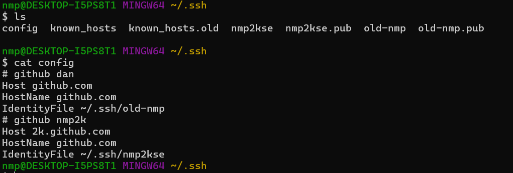
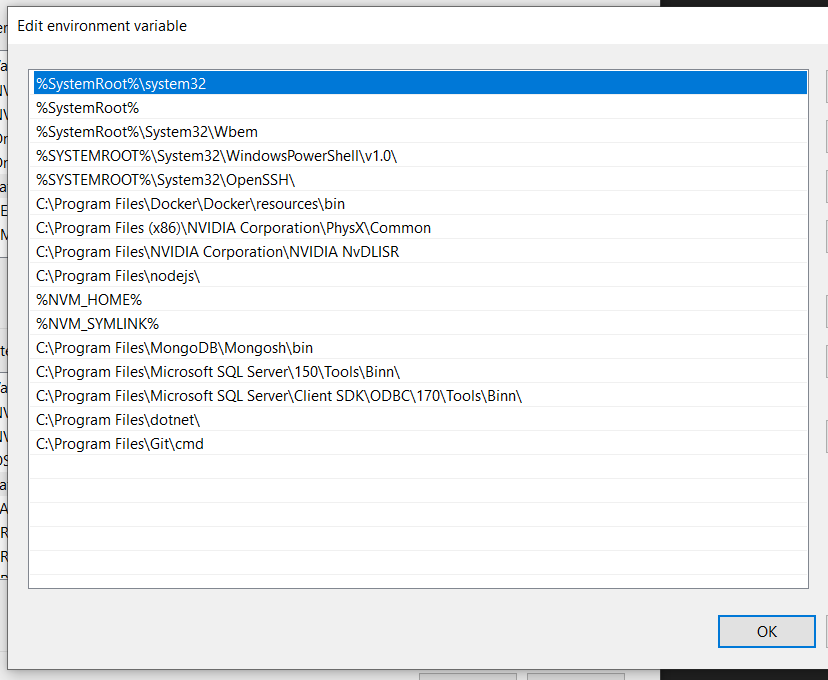
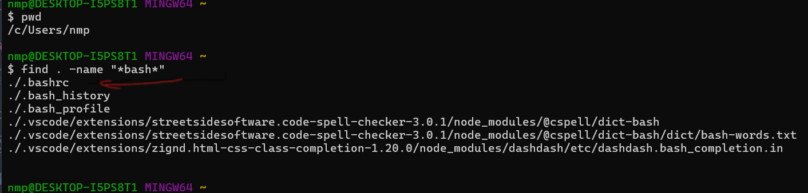
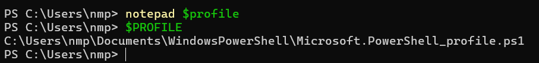
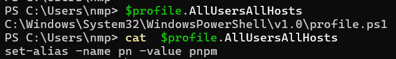

# environment setup

- **1. install ssh**
- **2. install git**
- **3. install notepad++**

**🎉[what is git](./basic.git.md)**

**🎉[logref & fsck when occur problem beyond repiar](./reflog.fsck.md)**

## setup

### ssh config:

copy this pate to: <b>~/.ssh/config</b>

<pre><code> 
# github dan
Host github.com
HostName github.com
IdentityFile ~/.ssh/old-nmp
# github nmp2k 
Host 2k.github.com
HostName github.com
IdentityFile ~/.ssh/nmp2kse
</code></pre>

### environment variable:

order of this file content can affect to some tools in shell environment

  

### shell profile:

1.bashrc locate   

2.bashrc content

<pre>
<code>
alias pn=pnpm
 # git alias
alias gitla='git log --oneline --all --graph'
alias gitls='git log --oneline'
alias gitshow='git show --name-only'
# notepad++ alias
export PATH=\$PATH:"c:/Program Files/Notepad++/"
note() {
"c:/Program Files/Notepad++/notepad++.exe" "$@" >/dev/null 2>&1 &
disown
}
</code>
</pre>

### window profile:

1.window profile locate

2.window profile content

<pre>
<code>
# git alias

function gitla { git log --oneline --all --graph $args }
function gitls { git log --oneline $args }
function gitshow { git show --name-only $args }

# notepad++ alias

function note {
& "C:\Program Files\Notepad++\notepad++.exe" @args
}
</code>
</pre>

3.window all hosts locate
  

