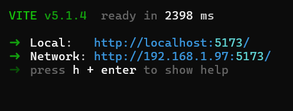

# internal network

### Surely you have seen this line every time you open the dev server

### or typing `pn dev --host ` in terminal :



Do you see the network line: http://192.168.1.97:5173/

Are you wondering how an internal server can be set up Or perhaps you simply want to test your application on another device in the development environment.

### To accomplish that, you need to know these things:

#### 1.How internal network IPs are assigned.

in a network, the IP address of a device (which could be a server) is determined by the DHCP server. For instance, in a home network, your WiFi router acts as the DHCP server.

#### 2.How to check and configure IPs in the internal network.

- first way: open terminal and type :
  ` ipconfig`

result:


- seconds way: with nodejs os module:

```
const os = require('os');

function getNetworkInfo() {
  const interfaces = os.networkInterfaces();
  const results = [];

  for (const name of Object.keys(interfaces)) {
    for (const iface of interfaces[name]) {
      const { address, netmask, family, internal } = iface;

      if (family === 'IPv4' && !internal) {
        results.push({
          name,
          address,
          netmask
        });
      }
    }
  }

  return results;
}

const networkInfo = getNetworkInfo();
console.log(networkInfo);

```

result:


note: u can change static ip on device with window settings

#### 3.Demonstration.

setup demo & test with http server :

```
const http = require('http');
const port = 49491;
const host = '192.168.1.97';

const requestListener = function (req, res) {
  res.writeHead(200);
  res.end('Hello, World!');
};

const server = http.createServer(requestListener);

server.listen(port, host, () => {
  console.log(`Server is running at http://${host}:${port}`);
});
```

result: 
