# Glimpse of postman

### 1. Workspace

invite team member to workspace
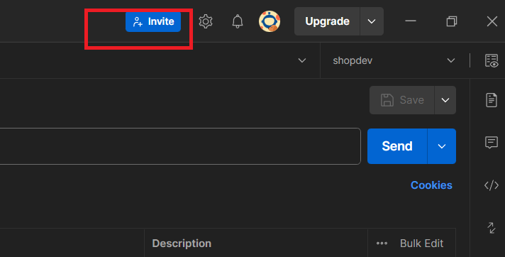

### 2. Collection & folder

save all request and manager endpoint

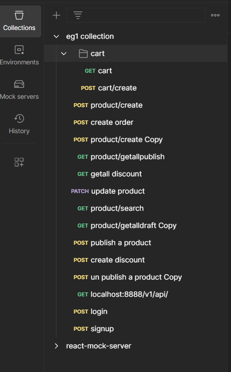

### 3. environment variable

environment select for collection

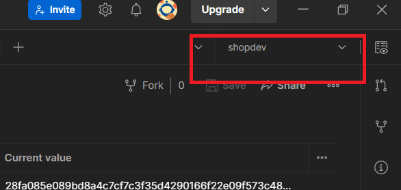

environment value

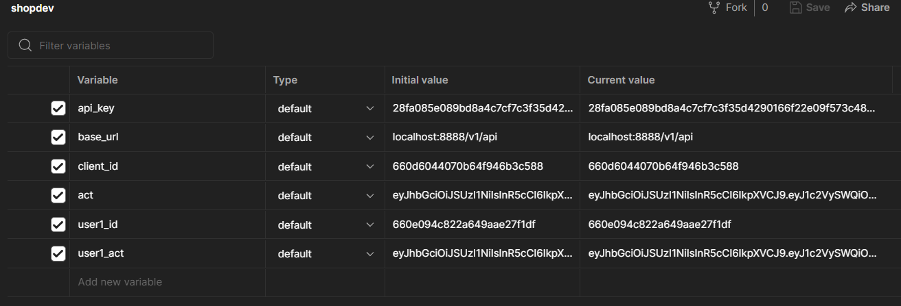

environment usage

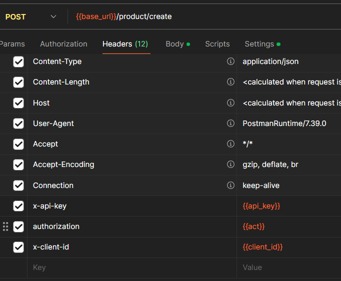

### 4. atom of request

support define & description query params & router params

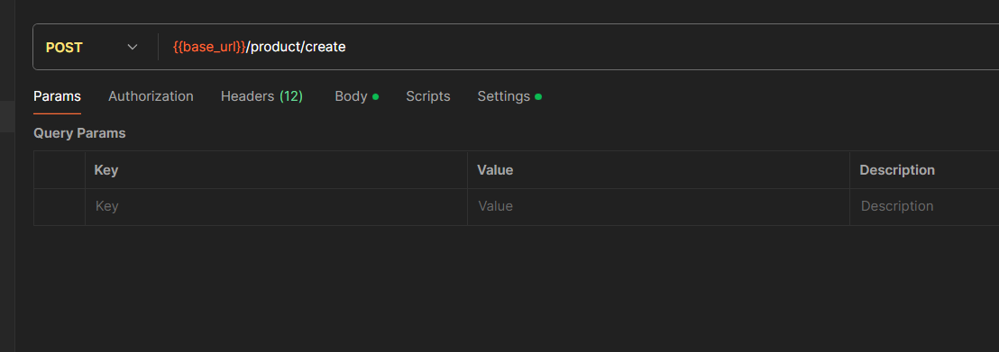

authentication header strategy

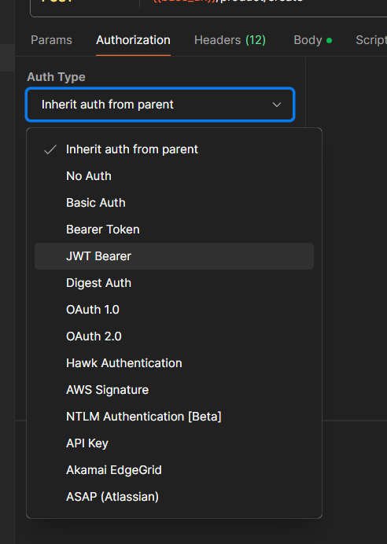

test script

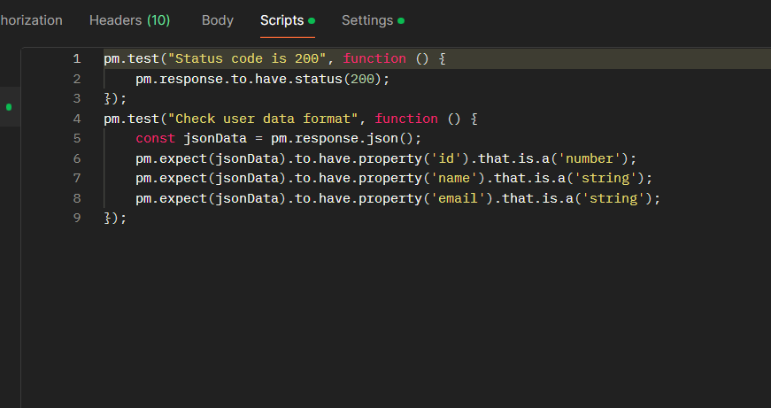

make it easy with script helper

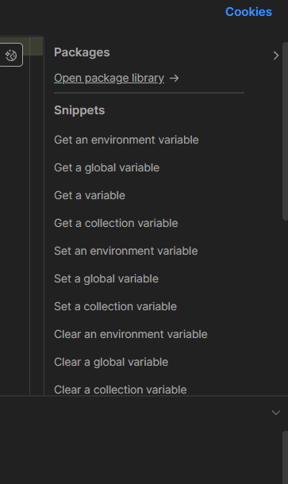

### 5. another ways get a request script

start here

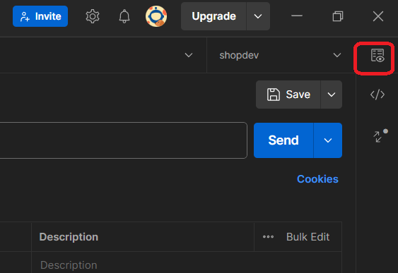

see results

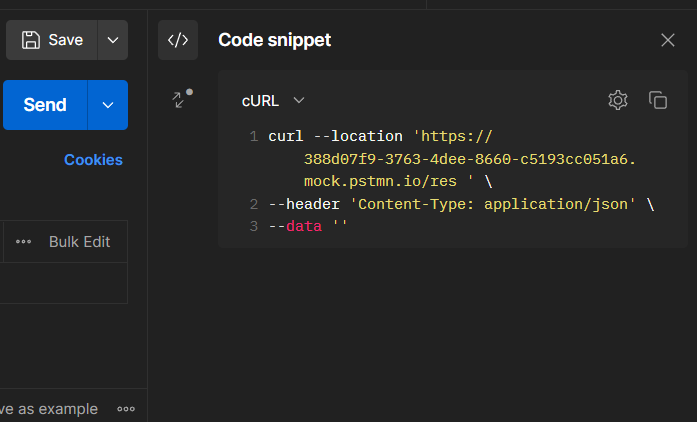

### 6. run test script entire collection

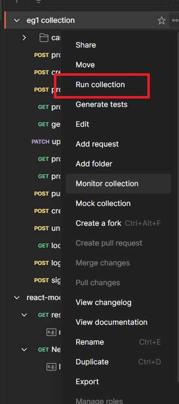

### 7. mock server

use [json-server](https://github.com/typicode/json-server) instead of postman mock server
for dynamic data
